### 如何开发一个独立的Gradle插件

从开始用Android Studio进行Android开发开始，Gradle就和我们形影不离了，因为Gradle的这套东西和我们熟悉的java差异较大，因此Gradle对我们常常是一个勉强够用的状态，至于怎么写一个可用的Gradle插件，往往更是不知如何下手了。在这篇文章里我将详细描述如何从零开始写一个Android的gradle插件。

### Gradle基础知识
Gradle的基本语法可以参考[
Gradle for Android](https://segmentfault.com/a/1190000004229002)这个系列，当然这个系列其实是参考[《Gradle For Android》](https://pan.baidu.com/s/1qW9mpBm)这本书的，英语过关的同学可以自己查看。

### 环境搭建
1. 安装Groovy
  安装教程应该有很多，安装完成后查看版本。如下所示：
  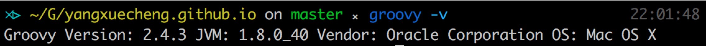

2. 安装[Gradle](https://gradle.org/)

3. 下载安装IntelliJ IDEA(我用的是2016.1.4)

### 创建工程
1. 新建项目,左边选择Gradle，上面选择自己的JDK版本，勾选上Groovy,下一步。
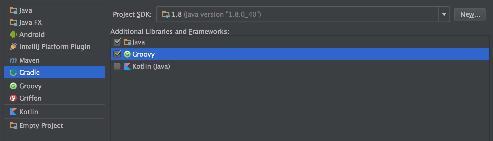

2. 填写自己的GroupId,ArtifactId。GroupId可以填公司的名字，ArtifactId则是你所编写的插件的名字，随便起一个名字。这里用 *com.yxc* 和 *blogpost*。至于Version的话可以先不动，点击下一步。
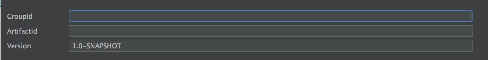

3. 默认设置，无需改变。点击下一步。给项目起个名字，这个无所谓，起好点击下一步。
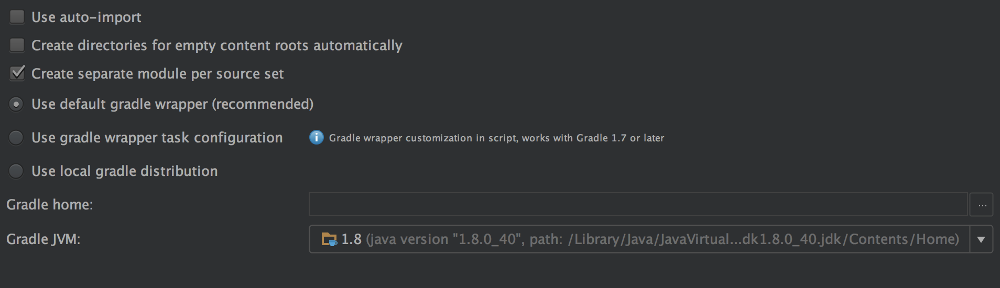

### 编写插件
1. 新建目录。在projet视图下，项目根目录上右键new,选择新建一个Directory，目录遵循惯例填写 *src/main/groovy*。

2. 新建一个package，例如 *com.yxc*,如下图所示。
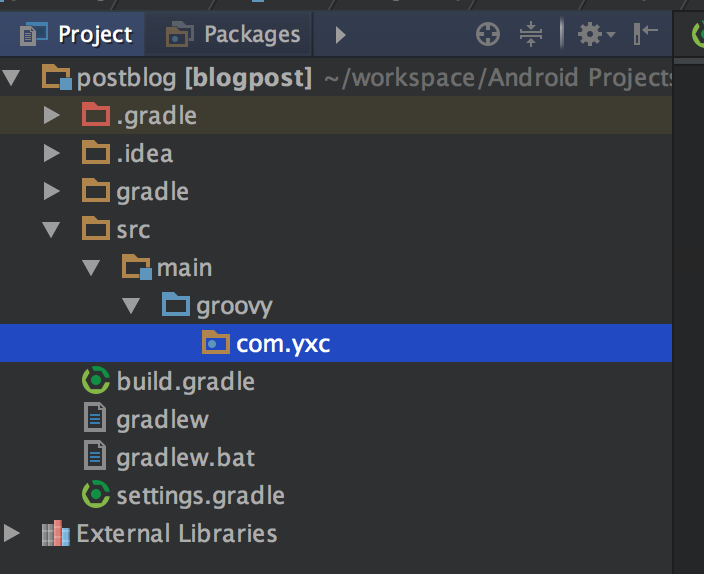

3. 新建一个Groovy类，命名随意，这里命名为 *BlogPlugin*。

4. 在build.gradle中添加依赖。

```
  compile gradleApi()
  compile localGroovy()
```

5. 默认右侧边栏应该可以看到gradle的工作区，点击展开，点击右上角的同步。Android Studio会在扫面到gradle文件有改动是自动提示同步，而IDEA木有这个功能。所以需要手动同步，看不到的可以在View-->ToolsWindow去找。

  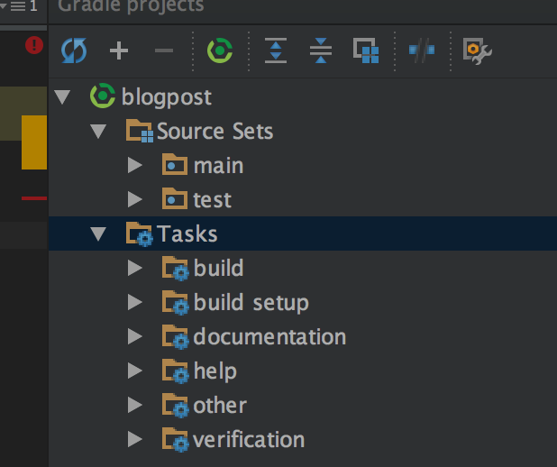

6. 回到 *BlogPlugin* 代码，让其实现Plugin的接口。选择org.gradle.api对应的那个。如下图所示。

```
package com.yxc
import org.gradle.api.Plugin
import org.gradle.api.Project
class BlogPlugin implements Plugin<Project> {
      @Override
      void apply(Project project) {
      }
}
```

7. 会提示必须要重写apply方法，apply是插件运行的入口，重写之。

8. 熟悉Gradle概念的同学应该知道，每一个build.grade文件代表着一个project，每一个project至少包含一个task，在这个插件里，我们定义一个简单的任务，显示连接的设备列表，也就是常用的命令 **adb devices**

```
@Override
void apply(Project project) {
    def showDevicesTask = project.tasks.create("showDevices") << {   //通过project的android属性来查找adb命令的路径
        def adbExe = project.android.getAdbExe().toString()
        //执行该命令，并输出结果
        println "${adbExe} devices".execute().text
    }

    // 指定该task的group,这个也就是我们在使用的时候看到的task的group的名字，见下文
    showDevicesTask.group = "blogplugin"
    //说明 我们常用的 ./gradlew tasks 时输出的task描述就是这个。
    showDevicesTask.description = "Runs adb devices command"
}
```

### 发布插件

1. 我们已经完成了上面的插件的创建，我们新建了一个插件，该插件的包含一个task，执行 **adb devices**。那现在我们怎么把这个插件用到我们的项目中呢，我们常用的插件一般都是发布到maven仓库，或者JCenter，那我们的插件怎么发布呢？发布到本地！

2. 我们可以讲我们的插件发布到本机指定的目录上。在build.gradle中添加如下代码。讲'repo'替换成任何你想要放置的目录，直接使用’repo'也是可以的，这样本地仓库就在当前工程的目录下的repo目录下，简单起见，我们就用‘repo’

```
apply plugin: 'maven'
uploadArchives {
    repositories {
        mavenDeployer {
            repository(url: uri('repo'))
        }  
    }
}
```

3. 刷新gradle的任务列表，会看到新增了一个upload的任务，双击uploadArchives。成功!
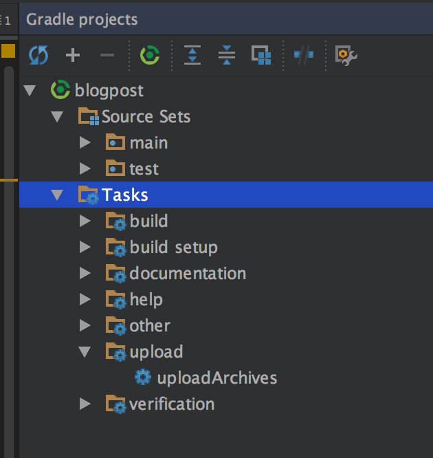
然后查看项目的目录下，是否多出了一个repo的目录。
我在运行的时候发现有错误。如下图所示：
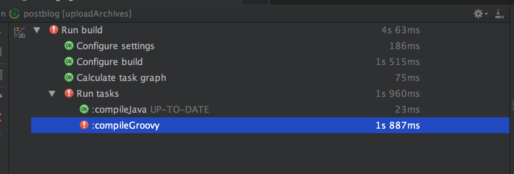
重新运行task，加上堆栈信息。
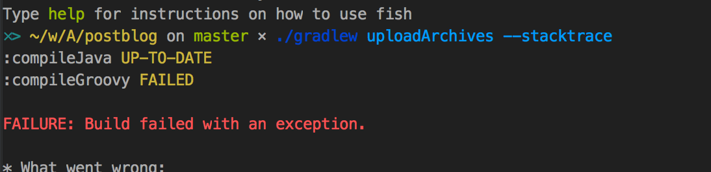
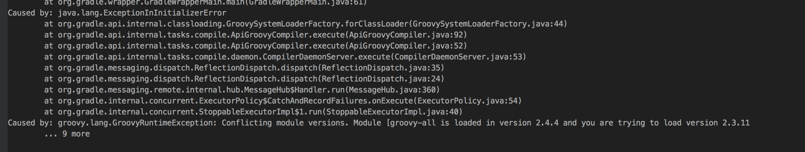
也就是说是grovvy版本不一致的问题，将dependency中groovy的版本改成2.4.4,重新同步工程,重新运行uploadArchives。成功!
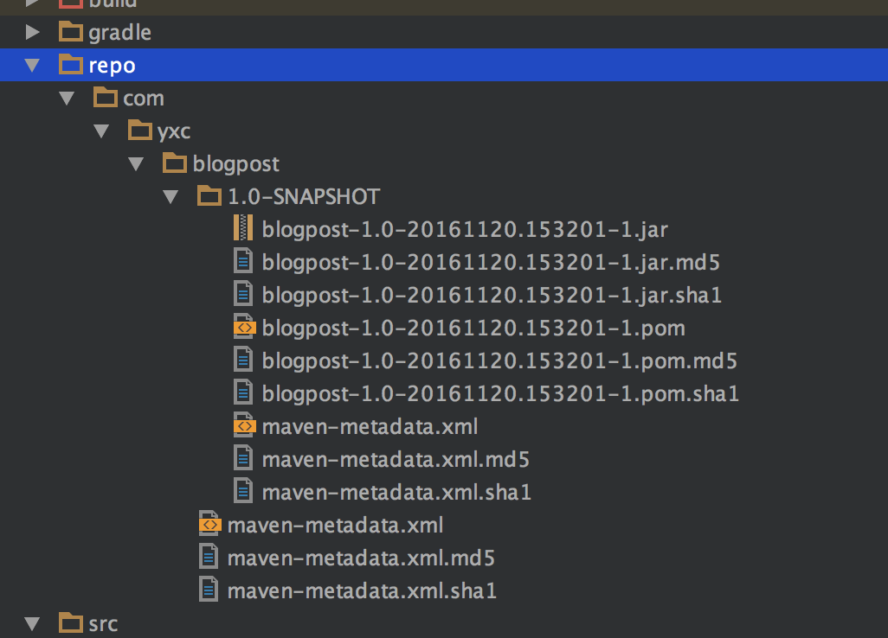

4. 再次运行uploadArchives，发现又生成了一份文件，并未将原来的文件覆盖,这是为何?这就是因为我们之前指定的的版本是SNAPSHOT，意味着我们会把每次运行的当前状态拍一份快照，如果我们不想要这么多快照，可以在 *build.gradle* 中吧Version的SNAPSHOT去掉。重新运行ploadArchives。
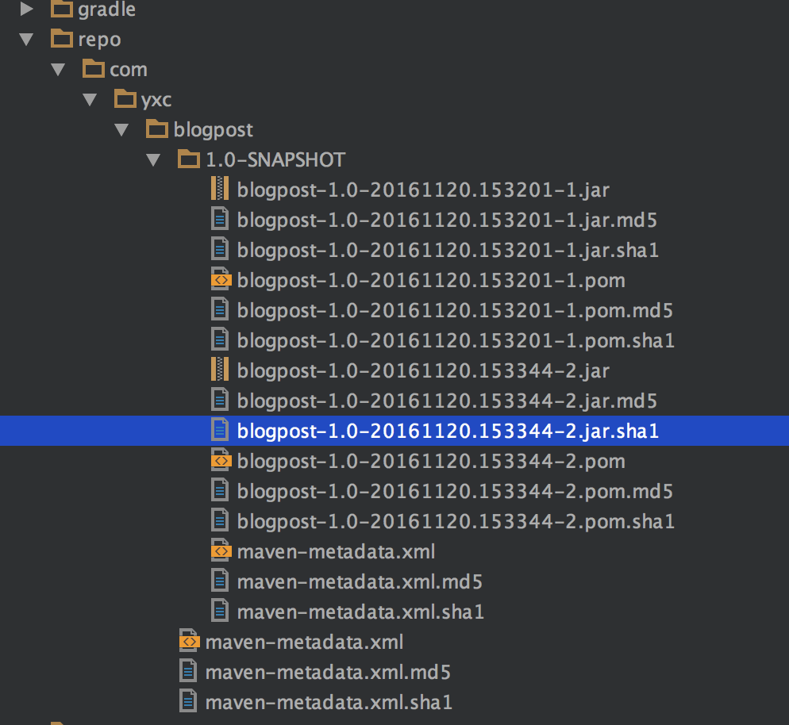

5. 我们还需要额外的一个文件告诉Gradle我们的插件在哪里。在mian文件夹上右键，选择新建目录。
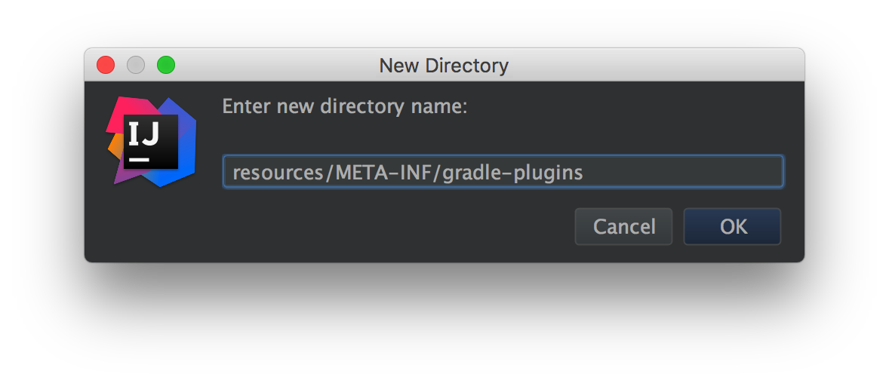

6. 在这个文件下新建一个文件，文件名为我们的Plugin的名字，也就是我们在build.gradle中最顶端用的时候用的名字，比如 ** com.android.application ** ,当然我们不应该这样命名，我这里命名为 ** com.yxc.blogpost**,文件的后缀为 .properties。
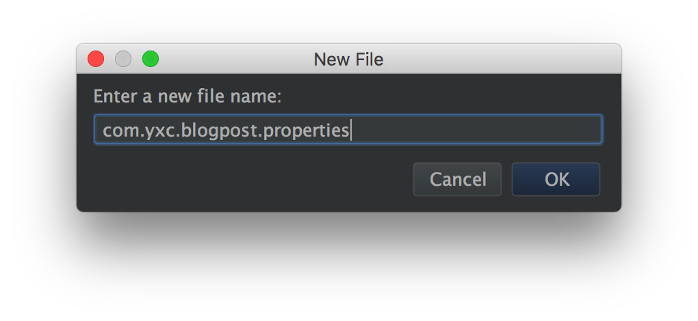

7. 在这个文件中添加一句话，指定插件的代码所在的位置

```
implementation-class=com.yxc.BlogPlugin
```

8. 再次运行uploadArchives，OK!插件已经发布到本地仓库了。


### 应用插件
1. 回到我们熟悉的Android Studio。新建一个项目，在项目的根目录的gradle文件中增加本地仓库。

```
repositories {
    maven {
        url uri('/path/to/your/repo')
    }
}
```

2. 在dependencies中增加blogpost的路径。两个冒号之间是artifactId,之前是groupId，之后是版本号。

```
dependencies {
    classpath 'com.android.tools.build:gradle:2.2.2'
    classpath 'com.yxc:blogpost:1.0'
}
```
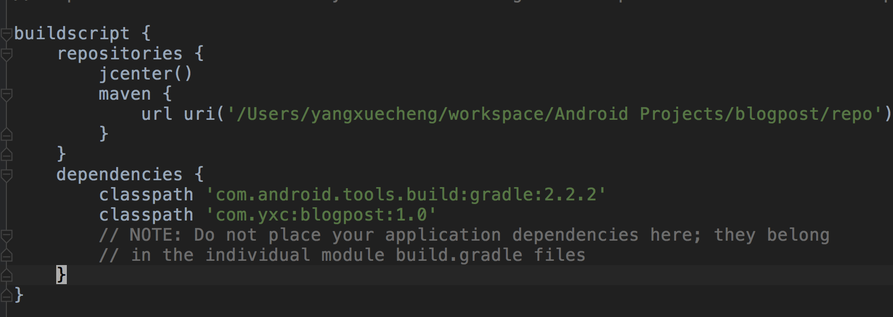

3. 在项目主模块的build.gradle中增加应用插件

```
apply plugin: 'com.yxc.blogplugin'
```

4. 同步项目，可以看到新的插件已经安装上了，双击shwoDevices即可运行。
或者可以在命令行中输入

```
./gradlew showDevices
```
即可看到运行效果。

到此，大功告成，我们的第一个Gradle插件编写完成。
